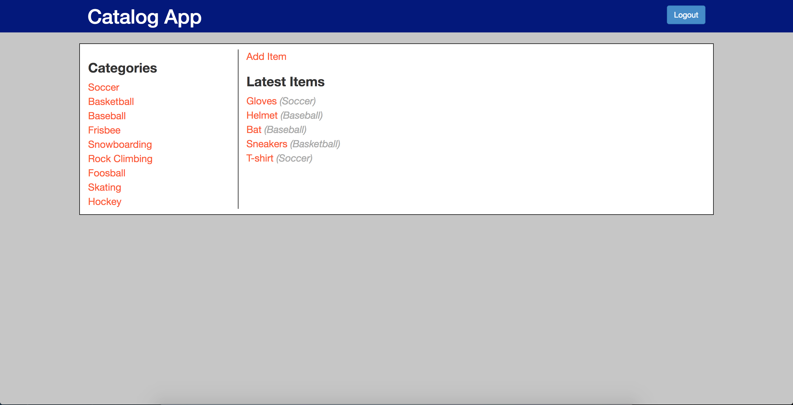
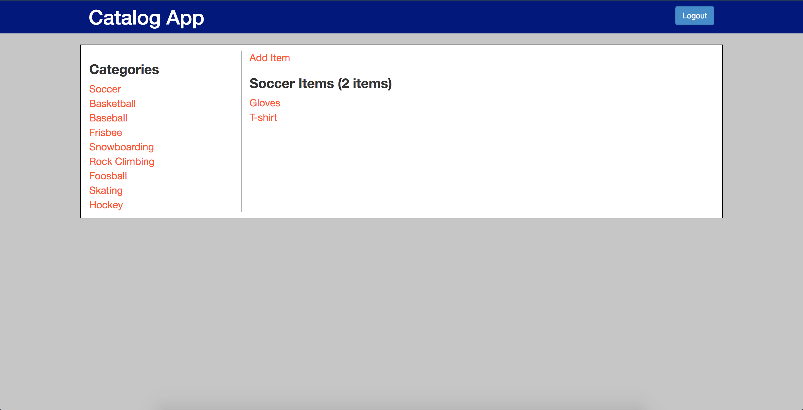
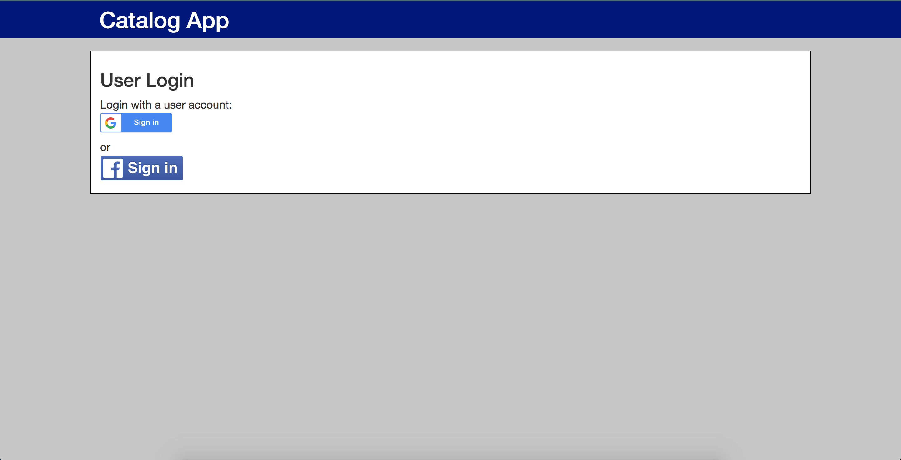
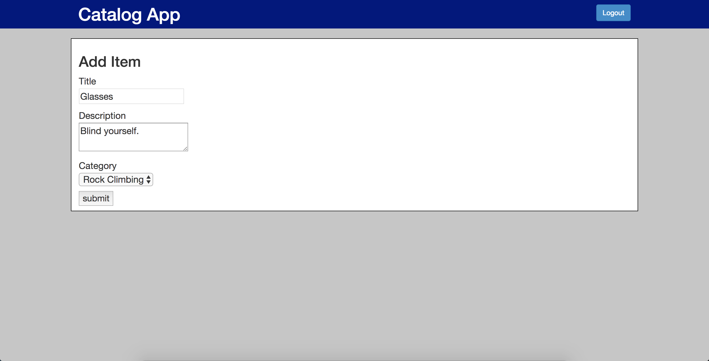

# Item_Catalog
This is a website that allows users to browse items in different catgories. The items are maintained by admins (users who have been authorized and authenticated by Google or Facebook OAuth 2.0 APIs).
- Users can add items (title, description, category).
- An item can only be updated/deleted by the user who created it.

## Skills Applied
1. MySQL database for data storage
2. Python server side back-end scripts running on Flask
3. Client side front-end web pages using Bootstrap JS framework for UI
4. A JSON endpoint that serves the same information as displayed in the HTML endpoints
4. RESTful APIs for CRUD implementations
5. Third party OAuth 2.0 service (Google, Facebook) for user authentication
6. User token signing using Python module itsdangerous
7. Cross-Site Request Forgery (CSRF) protection using session state
8. Post-Redirect-Get (PRG) pattern to prevent false submission

## Database Schema
User

| Column        | Type          |
| ------------- |:-------------:|
| id      | Integer |
| username      | String      |
| email | String      |
| picture | String      |
| passwor_hash | String      |

Category

| Column        | Type          |
| ------------- |:-------------:|
| id      | Integer |
| name      | String      |

Item

| Column        | Type          |
| ------------- |:-------------:|
| id      | Integer |
| name      | String      |
| description | String      |
| category_name | FK(Category)      |
| user_id | FK(User)      |

## Usage
Make sure you have all dependencies installed on your local machine. They are:
- vagrant (virtual environment setup tool)
- itsdangerous (Python token signing module)
- sqlalchemy (Python SQL toolkit)
- passlib.apps (Python password hashing library)
- requests (Python HTTP requests handling module)
- Flask (Python web server framework)
- Flask-HTTPAuth (Python HTTP authentication extension)
- oauth2client (Google OAuth client-side library)

Git clone this repo to your local machine
```
$ git clone https://github.com/hungyunliao/P4-Item_Catalog.git
```

Start Vagrant
```
$ vagrant up
$ vagrant ssh
```

Cd to '/vagrant/catalog/'
```
$ cd /vagrant/catalog
```

Create your `client_secret.json` and `fb_client_secret.json`, and place them under `/vagrant/catalog/`. The JSON files should be something like
```
client_secret.json (GOOGEL):
{
    "web":{
        "client_id":"Account ID goes here",
        "project_id":"Project ID goes here",
        "auth_uri":"https://accounts.google.com/o/oauth2/auth",
        "token_uri":"https://accounts.google.com/o/oauth2/token",
        "auth_provider_x509_cert_url":"https://www.googleapis.com/oauth2/v1/certs",
        "client_secret":"Client secret goes here",
        "redirect_uris":["https://localhost:5000/"],
        "javascript_origins":[
            "http://localhost:5000",
            "http://127.0.0.1"
        ]
    }
}

fb_client_secret.json (FACEBOOK):
{
    "web" : {
        "app_id" : "APP ID goes here",
        "app_secret" : "APP SECRET goes here"
    }
}
```

Propagate Category, Item data
```
$ python create_db.py
```

Run the server script
```
$ python application.py
```

**HTML endpoints (CRUD)**

Open the browser and visit the following url on your local machine
```
http://local:5000/
```


**JSON endpoint**

Generate signed tokens (Note: token expires after 10 mins)
```
$ curl -X POST -i -u "testuser":"testps" "http://localhost:5000/tokens"

Response:
{
  "token": "eyJhbGciOiJIUzI1NiIsImV4cCI6MTUzMTg5NDY1OSwiaWF0IjoxNTMxODk0MDU5fQ.eyJpZCI6MX0.66mzV4LW6t3BsQMY2tYuBQ3xx8zZiNlPRf5M6IB5uro"
}
```

Get the app JSON data using token
```
$ curl -i -u tokenString:blank "http://localhost:5000/categories.json"
```

Get the app JSON data using credential
```
$ curl -i -u "testuser":"testps" "http://localhost:5000/categories.json"
```

## Website Screenshots
Show latest items (http://localhost:5000/categories)


Show latest items (logged in) 


Show category items (http://localhost:5000/categories/Soccer/items)


Show item description (http://localhost:5000/categories/Baseball/Helmet)


Show item description (the user who created it) (http://localhost:5000/categories/Rock%20Climbing/Glasses)


Login screen (http://localhost:5000/login)


Add item (http://localhost:5000/categories/items/add)


JSON endpoint (http://localhost:5000/categories.json)

